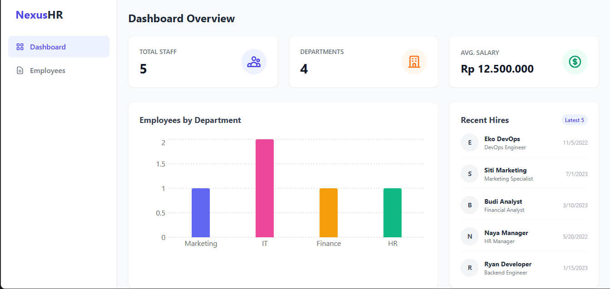
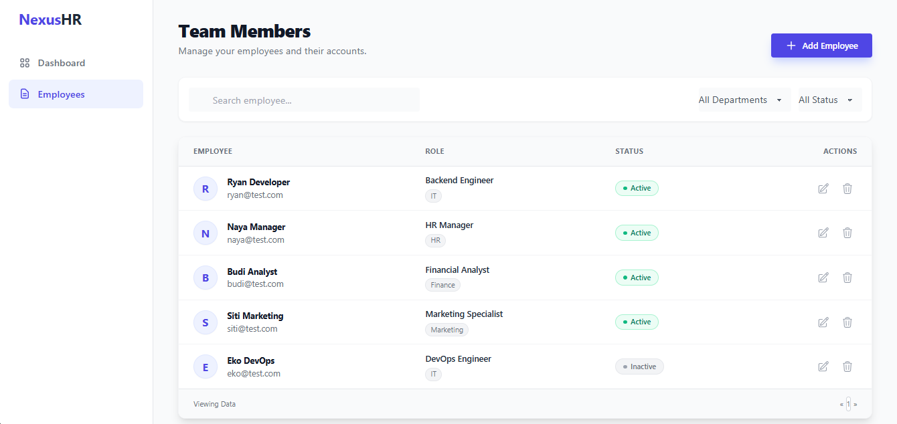
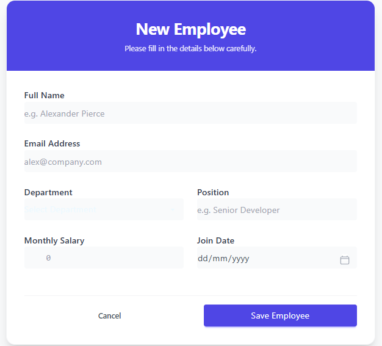
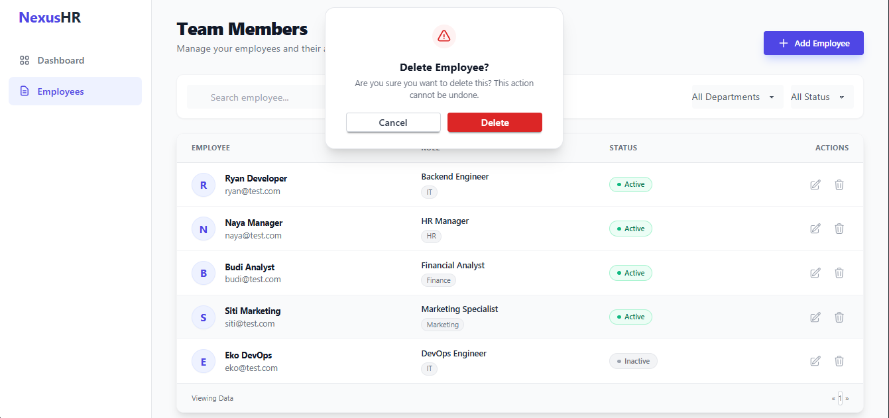

# 🚀 Sistem Manajemen Karyawan (Employee Management System)

Aplikasi web *Full Stack* modern untuk mengelola data karyawan, dilengkapi dengan Dashboard Analitik. 

Aplikasi ini dirancang menggunakan arsitektur *Client-Server* terpisah (Decoupled) dan dikemas menggunakan **Docker** untuk kemudahan deployment.

---

## 📸 Tangkapan Layar (Screenshots)

| Dashboard Statistik | Daftar Karyawan |
|:-------------------:|:---------------:|
|  |  |

| Form Tambah/Edit | Konfirmasi Hapus |
|:----------------:|:----------------:|
|  |  |

*(Catatan: Screenshot disimpan dalam folder `screenshots` di root project)*

---

## ✨ Fitur Utama

### 1. 📊 Dashboard Interaktif
* Visualisasi data jumlah karyawan per departemen menggunakan grafik batang (**Recharts**).
* Ringkasan statistik: Total Karyawan, Jumlah Departemen, dan Rata-rata Gaji.
* Daftar "Recent Hires" (5 karyawan terbaru).

### 2. 👥 Manajemen Karyawan (CRUD)
* **Create:** Menambah karyawan baru dengan validasi input.
* **Read:** Menampilkan daftar karyawan dengan tabel responsif.
* **Update:** Edit data karyawan yang sudah ada.
* **Delete:** Menghapus data dengan **Dialog Konfirmasi Modern** (bukan alert browser).

### 3. 🔍 Pencarian & Filter Canggih
* **Search:** Cari nama karyawan secara *real-time*.
* **Filter:** Saring data berdasarkan **Departemen** dan **Status** (Active/Inactive).

### 4. 🎨 UI/UX Modern
* Dibangun dengan **Tailwind CSS** & **DaisyUI**.
* Desain responsif (Mobile-Friendly).
* Notifikasi *Toast* untuk setiap aksi sukses/gagal.
* Loading state yang informatif.

---

## 🛠 Tech Stack

**Frontend:**
* React.js (Vite)
* Tailwind CSS + DaisyUI
* Axios (HTTP Client)
* Recharts (Visualisasi Data)
* React Hot Toast (Notifikasi)

**Backend:**
* Node.js
* Express.js
* Prisma ORM
* PostgreSQL (Database)

**DevOps:**
* Docker & Docker Compose

---

## ⚙️ Prasyarat (Prerequisites)

Sebelum menjalankan aplikasi, pastikan komputer Anda sudah terinstal:
1.  **[Docker Desktop](https://www.docker.com/products/docker-desktop/)**.
2.  **Git**.
3. **(Opsional)** Node.js jika ingin menjalankan tanpa Docker
---

## 🚀 Cara Instalasi & Menjalankan (Metode Docker)

1.  **Clone Repository**
    ```bash
    git clone <https://github.com/Midoryan01/employee-management.git>
    cd employee-management
    ```

2.  **Jalankan Aplikasi**
    Perintah ini akan men-build image frontend & backend, serta menyiapkan database.
    ```bash
    docker-compose up --build
    ```

3.  **Akses Aplikasi**
    * **Frontend (Web UI):** Buka [http://localhost:5173](http://localhost:5173)
    * **Backend (API):** Berjalan di [http://localhost:5000](http://localhost:5000)
    * **Database:** Port `5432`

> **Catatan:** Database akan otomatis terisi dengan **Sample Data (Dummy)** saat pertama kali dijalankan (melalui script `init.sql`).

---

## 📡 Dokumentasi API

Berikut adalah daftar endpoint REST API yang tersedia di Backend:

### Karyawan (Employees)

| Method | Endpoint | Deskripsi |
| :--- | :--- | :--- |
| `GET` | `/api/employees` | Mengambil semua data. Mendukung query param: `?department=IT&status=active` |
| `GET` | `/api/employees/:id` | Mengambil detail 1 karyawan berdasarkan ID |
| `POST` | `/api/employees` | Menambah karyawan baru. (Body: JSON data karyawan) |
| `PUT` | `/api/employees/:id` | Mengupdate data karyawan berdasarkan ID |
| `DELETE` | `/api/employees/:id` | Menghapus karyawan berdasarkan ID |

### Statistik (Dashboard)

| Method | Endpoint | Deskripsi |
| :--- | :--- | :--- |
| `GET` | `/api/stats` | Mengembalikan object JSON berisi Total Karyawan, Breakdown Dept, dan Avg Salary |

---

# 🧪 Contoh Request (cURL)

Anda dapat menyalin dan menjalankan perintah berikut untuk menguji API secara manual.

---

## 1. Tambah Karyawan Baru (POST)

```bash
curl -X POST http://localhost:5000/api/employees \
-H "Content-Type: application/json" \
-d '{"name": "Budi Santoso", 
    "email": "budi@test.com", 
    "position": "Dev", 
    "department": "IT", 
    "salary": 9000000, 
    "hire_date": "2024-01-01"}'
```

## 2. Update Data Karyawan (PUT)

curl -X PUT http://localhost:5000/api/employees/1 \
-H "Content-Type: application/json" \
-d '{"status": "inactive", "salary": 10000000}'


## 3. Hapus Karyawan (DELETE)
curl -X DELETE http://localhost:5000/api/employees/1

## 📂 Struktur Proyek

```text
employee-management/
├── backend/                # Kode Sumber Backend
│   ├── prisma/             # Schema Database
│   ├── src/
│   │   ├── controllers/    # Logika Bisnis (CRUD & Stats)
│   │   ├── routes/         # Definisi Route API
│   │   └── index.js        # Entry Point Server
│   └── Dockerfile          # Konfigurasi Image Backend
├── frontend/               # Kode Sumber Frontend
│   ├── src/
│   │   ├── components/     # Komponen UI (Dashboard, List, Form)
│   │   └── App.jsx         # Routing & Layout Sidebar
│   └── Dockerfile          # Konfigurasi Image Frontend
├── database/
│   └── init.sql            # Script SQL untuk Seeding Data Awal
├── screenshots/            # kumpulan gambar aplikasi
├──.env.example             # Template contoh konfigurasi env
├── docker-compose.yml      # Orkestrasi Container (DB + Backend + Frontend)
└── README.md               # Dokumentasi Proyek